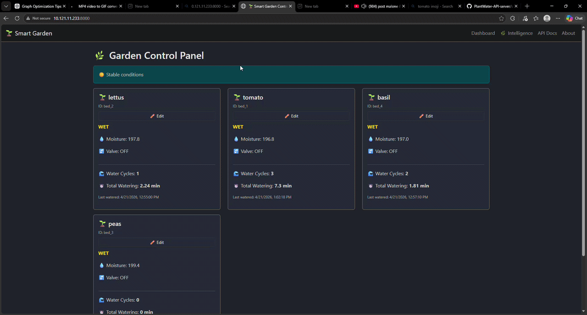

# PlantWater API Server

<p align="center">
  
</p>

## Overview

A lightweight FastAPI-based server for a smart irrigation system. The API stores plant bed sensor readings, manages watering configurations, evaluates watering decisions with weather-aware logic, and exposes endpoints for historical and graph-ready data. A simulator script (`src/simulator.py`) sends synthetic ESP32-style sensor data and exercises the watering decision endpoint.

## Repository Structure

- `src/main.py` - FastAPI application with database models, weather integration, and endpoints.
- `src/simulator.py` - Simulation script that posts sensor data and requests watering decisions.
- `database.db` - SQLite database file created automatically when the server runs.

## Requirements

- Python 3.10+ (recommended)
- FastAPI
- Uvicorn
- SQLAlchemy
- Pydantic
- Requests

Install dependencies with:

```bash
pip install fastapi uvicorn sqlalchemy pydantic requests
```

## Running the API Server

Start the server from the repository root:

```bash
uvicorn src.main:app --reload
```

The API will be available at `http://127.0.0.1:8000`.

## Running the Simulator

The simulator sends fake moisture data for three beds and checks if watering should occur.

```bash
python src/simulator.py
```

It targets `http://127.0.0.1:8000` by default.

## API Endpoints

### Sensor Data Ingestion

- `POST /api/bed-data`
- Stores incoming bed sensor readings.
- Payload example:

```json
{
  "bed_id": "bed_1",
  "timestamp": "2026-04-17T10:30:00",
  "sensors": [520.0, 505.0, 510.0, 515.0, 500.0],
  "average": 510.0,
  "valve_state": "OFF",
  "rssi": -50
}
```

### Latest Bed State

- `GET /api/beds`
- Returns latest reading for each bed.

### Latest Bed State (Alternative)

- `GET /api/beds/latest`
- Returns only the most recent record per bed.

### Bed History

- `GET /api/beds/{bed_id}/history`
- Returns the last 100 readings for a bed.

### Time Range Query

- `GET /api/beds/{bed_id}/range?start={start}&end={end}`
- Returns readings within a timestamp range.

### Graph-Ready Data

- `GET /api/beds/{bed_id}/graph`
- Returns arrays of `timestamps`, `average`, and `valve` values for charting.

### Statistics

- `GET /api/beds/{bed_id}/stats`
- Returns count, min, max, avg, and last moisture reading.

### Bed Configuration

- `GET /api/config/{bed_id}`
- Retrieves current configuration for the bed.

- `POST /api/config/{bed_id}`
- Updates configuration values.
- Payload can include any of:
  - `moisture_threshold`
  - `watering_duration_sec`
  - `cooldown_sec`
  - `sampling_interval_sec`

### Watering Decision

- `POST /api/should-water?bed_id={bed_id}&average_moisture={avg}`
- Returns whether the bed should be watered based on soil moisture and current weather.

### Weather Endpoints

- `GET /api/will-rain` - Returns cached forecast-based rain prediction.
- `GET /api/weather/current` - Returns current weather status from OpenWeather.

### Health and Maintenance

- `GET /health` - Simple health check.
- `DELETE /api/cleanup` - Deletes readings older than 7 days.

## Simulator Behavior

The simulator in `src/simulator.py` does the following:

- Defines three simulated beds: `bed_1`, `bed_2`, `bed_3`.
- Simulates soil moisture drying over time with noise.
- Generates 5 sensor readings per bed.
- Posts each reading to `/api/bed-data`.
- Queries `/api/should-water` to decide whether watering should occur.
- If watering is recommended, it increases the simulated soil moisture.
- Repeats every 2 seconds.

## Notes

- The weather integration uses OpenWeather API, currently set to `Detroit,US`.
- The server caches forecast results for 10 minutes to reduce external API calls.
- The database is SQLite and will be created automatically as `database.db`.
- The simulator sends data continuously until stopped.

## Optional Dashboard

The app also serves a simple dashboard at `/` with a bed status summary and a moisture chart.

## Important

If you want to change the weather location or API key, update `CITY` and `OPENWEATHER_API_KEY` in `src/main.py`.


## TODO:

1. Get the watering status to show up on dashbord  - x 
2. get text messageing the stats of the system working 
3. add a watering counter life time >w< -x 
4. Add discord status to discord bot ngl -x 
5. get valve status to work on graph -x 
6. add APi keys to the pain endpoints that require it like the bed data and etc -x 
7. fix ux of the historical data page -x x
8. Ad ai like plant s status stuff  
9. get ip adresses to show up on device page 

